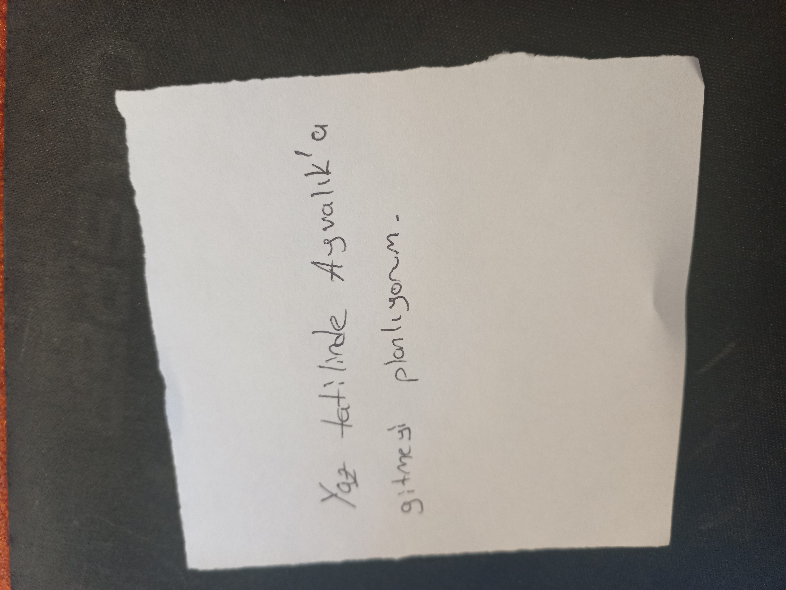
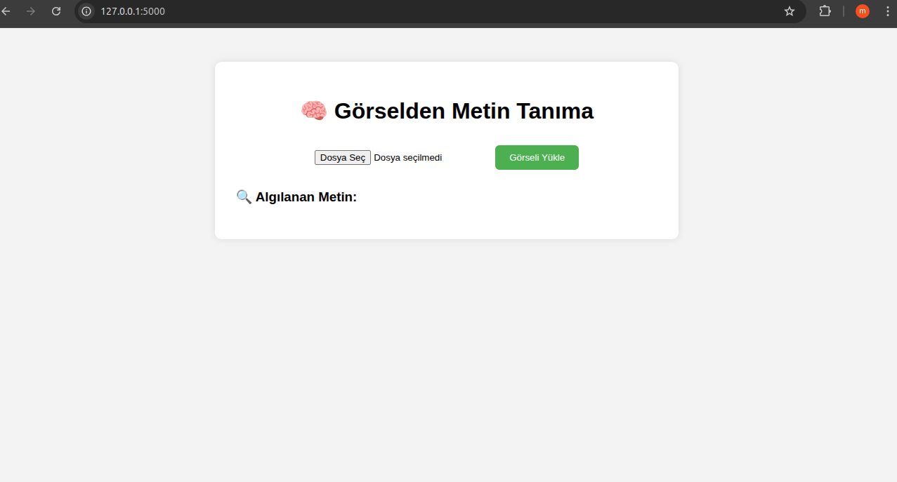
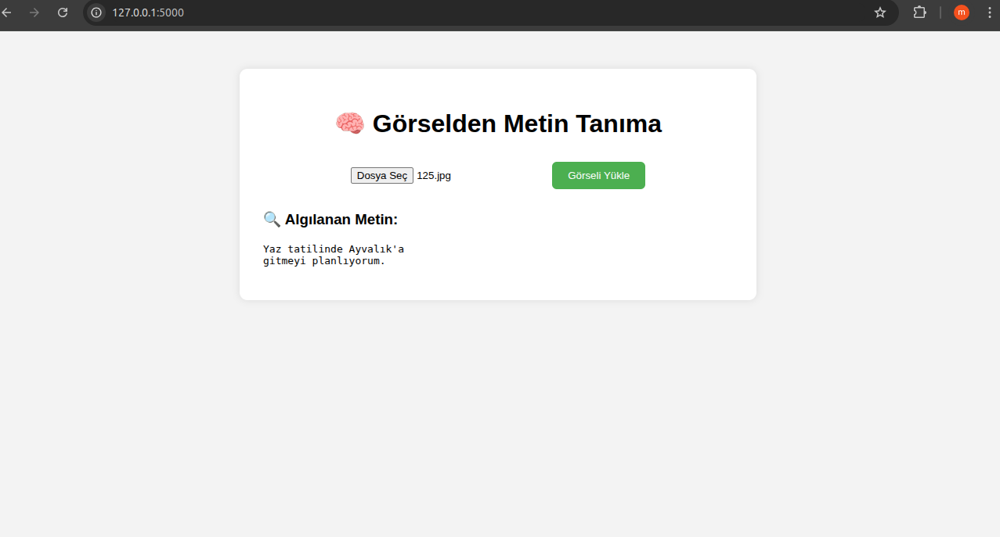

# Flask OCR Project (Google Vision API) 🔎

A minimal **Flask** application that performs **OCR (text extraction)** on uploaded images using **Google Cloud Vision API**.

---

## ✨ Features
- Upload an image and extract text with **Google Vision OCR**.
- Simple HTML form interface.
- Returns JSON response for detected text.

---

## 📦 Installation

```bash
git clone https://github.com/mustafaaesen/flask-ocr-project.git
cd flask-ocr-project
python3 -m venv .venv
source .venv/bin/activate   # (Linux/macOS)
pip install -r requirements.txt
```
## 📷 Screenshots

### Test Input


### OCR Input Screenshot


### OCR Output Screenshot



🔐 Google Vision API Key Setup

This project requires a Google Cloud Service Account key in JSON format.
For security reasons, this repository does not include the JSON key file and does not hardcode credentials.

Create a service account in Google Cloud Console and enable Vision API.

Download the key JSON file locally (do not commit it).

Export the path to your JSON file before running:

export GOOGLE_APPLICATION_CREDENTIALS="/absolute/path/to/your-key.json"
python3 app.py

📁 Project Structure
```
flask-ocr-project/
│
├── app.py
├── requirements.txt
├── .gitignore
├── templates/
│   └── index.html
├── static/
├── images/
│   ├── screenshot1.png
│   ├── screenshot2.png
│   └── 125.jpg
```


